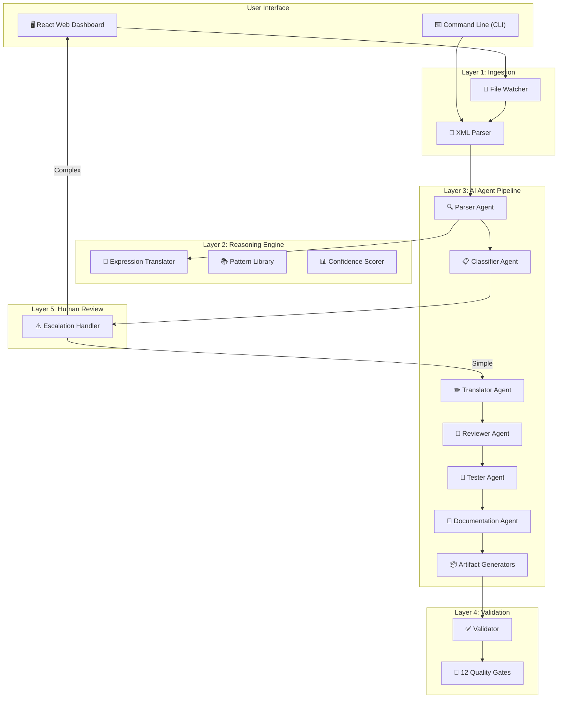
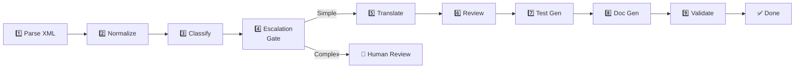

# IBM DataStage ETL Modernization Suite

> **Automatically migrate IBM DataStage ETL jobs to Apache PySpark and Google Cloud DataFusion using AI agents.**

---

## Table of Contents

- [What Is This Project?](#what-is-this-project)
- [Why Does This Exist?](#why-does-this-exist)
- [How It Works — The Big Picture](#how-it-works--the-big-picture)
- [Architecture Overview](#architecture-overview)
- [The 5-Layer Architecture (Deep Dive)](#the-5-layer-architecture-deep-dive)
  - [Layer 1 — Ingestion](#layer-1--ingestion-reading-the-old-files)
  - [Layer 2 — Reasoning Engine](#layer-2--reasoning-engine-the-translation-brain)
  - [Layer 3 — AI Agent Pipeline](#layer-3--ai-agent-pipeline-the-workers)
  - [Layer 4 — Validation](#layer-4--validation-quality-control)
  - [Layer 5 — Human Review](#layer-5--human-review-safety-net)
- [The 9-Step Pipeline](#the-9-step-pipeline)
- [The 6 AI Agents Explained](#the-6-ai-agents-explained)
- [What Gets Generated (8 Output Artifacts)](#what-gets-generated-8-output-artifacts)
- [The Web Dashboard (UI)](#the-web-dashboard-ui)
- [LLM Provider Support](#llm-provider-support)
- [Project Structure](#project-structure)
- [Getting Started](#getting-started)
- [Running Tests](#running-tests)
- [Configuration](#configuration)
- [FAQ](#faq)

---

## What Is This Project?

Many large enterprises run their data pipelines (ETL — Extract, Transform, Load) on **IBM DataStage**, a legacy tool that has been industry-standard for decades. These organizations are now migrating to modern cloud-based platforms like **Apache PySpark** and **Google Cloud DataFusion**.

**The problem?** Manually rewriting hundreds of DataStage jobs is expensive, slow, and error-prone. A single complex job can take a senior engineer days to migrate.

**This project solves that.** It uses **AI agents powered by large language models (LLMs)** to automatically:
1. Read and understand the old DataStage job files
2. Translate them into modern PySpark and DataFusion code
3. Generate tests, documentation, and validation reports
4. Flag complex jobs for human review

Think of it as an **AI-powered translator** — but instead of translating English to French, it translates old ETL code to new ETL code.

---

## Why Does This Exist?

| Without This Tool | With This Tool |
|---|---|
| Engineers manually read XML files | AI reads and understands them automatically |
| Days per job to migrate | Minutes per job |
| High risk of translation errors | AI + validation catches issues |
| No test suite generated | Full pytest suite auto-generated |
| No documentation | 7-section migration doc auto-generated |
| Simple jobs treated same as complex | AI scores complexity, routes complex jobs to humans |

---

## How It Works — The Big Picture

Here's the simplest way to understand what happens when you drop a DataStage file into the system:

```
┌─────────────────┐
│  DataStage File  │  ← You provide this (.dsx file)
│  (Old ETL Code)  │
└────────┬────────┘
         │
         ▼
┌─────────────────────────────────────────────────────┐
│              AI Migration Pipeline                   │
│                                                      │
│  1. Read the file                                    │
│  2. Understand what the job does                     │
│  3. Assess how complex it is                         │
│  4. If too complex → ask a human for help            │
│  5. Generate PySpark + DataFusion code               │
│  6. Review the generated code for errors             │
│  7. Generate a full test suite                       │
│  8. Write migration documentation                    │
│  9. Validate everything against quality standards    │
│                                                      │
└────────┬────────────────────────────────────────────┘
         │
         ▼
┌─────────────────────────────────────────┐
│           8 Output Artifacts             │
│                                          │
│  ✅ PySpark script (.py)                 │
│  ✅ DataFusion config (.json)            │
│  ✅ Migration report (.json)             │
│  ✅ Validation report (.json)            │
│  ✅ Metadata catalog (.json)             │
│  ✅ Data lineage graph (.json)           │
│  ✅ DDL statements (.sql)                │
│  ✅ Test harness (pytest)                │
│                                          │
└──────────────────────────────────────────┘
```

---

## Architecture Overview

The system follows a **5-layer architecture** with a **9-step LangGraph pipeline** at its core:



---

## The 5-Layer Architecture (Deep Dive)

### Layer 1 — Ingestion (Reading the Old Files)

**What it does:** Reads IBM DataStage `.dsx` and `.isx` files (which are XML) and converts them into a structured JSON format that the AI agents can understand.

**Analogy:** Like scanning a physical document and converting it to a digital format that a computer can read.

#### Components

| File | Purpose |
|------|---------|
| `xml_parser.py` | Reads the XML, extracts every stage (source, transformer, target), every link between stages, every column definition, SQL queries, join keys, and connection strings |
| `file_watcher.py` | Monitors a folder for new `.dsx` files and automatically triggers the pipeline when one appears |

#### What the Parser Extracts

```
DataStage DSX File
    │
    ├── Job Name & Description
    ├── Stages (the building blocks)
    │     ├── Sources (where data comes from: Oracle, DB2, files)
    │     ├── Transformers (calculations, filtering, lookups)
    │     └── Targets (where data goes to: BigQuery, files)
    ├── Links (how data flows between stages)
    ├── Columns (field names, data types, sizes)
    ├── SQL Queries (embedded in source stages)
    ├── Parameters (like ${DS_RUNDATE})
    └── Complexity Hints (SCD logic, CDC, custom stages)
```

---

### Layer 2 — Reasoning Engine (The Translation Brain)

**What it does:** Contains the domain knowledge of an experienced DataStage migration engineer. It knows how to convert DataStage functions, expressions, and patterns into their PySpark and DataFusion equivalents.

**Analogy:** Like a bilingual dictionary — it knows that DataStage's `Upcase()` means PySpark's `upper()`, and DataStage's `Nvl()` means PySpark's `coalesce()`.

#### Components

| File | Purpose |
|------|---------|
| `reasoning_engine.py` | The main translator — converts expressions, conditionals, joins, aggregations |
| `pattern_library.py` | Dictionary of 70+ DataStage → PySpark/DataFusion function mappings |
| `confidence_scorer.py` | Scores each job from 0.0 (very complex) to 1.0 (very simple) |

#### Expression Translation Examples

| DataStage Expression | PySpark Output | DataFusion Output |
|---|---|---|
| `Upcase(NAME)` | `upper(NAME)` | `UPPER(NAME)` |
| `Nvl(REGION, 'UNKNOWN')` | `coalesce(REGION, 'UNKNOWN')` | `COALESCE(REGION, 'UNKNOWN')` |
| `Year(ORDER_DATE)` | `year(ORDER_DATE)` | `YEAR(ORDER_DATE)` |
| `Round(PRICE, 2)` | `round(PRICE, 2)` | `ROUND(PRICE, 2)` |
| `If X > 100 Then "HIGH" Else "LOW"` | `when(X > 100, "HIGH").otherwise("LOW")` | `CASE WHEN X > 100 THEN 'HIGH' ELSE 'LOW' END` |

#### Confidence Scoring

The scorer analyzes the job structure and assigns a confidence score:

```
Score ≥ 0.75  →  "Simple"   →  Fully automated, no human needed
Score ≥ 0.45  →  "Medium"   →  Needs human review of flagged sections
Score < 0.45  →  "Complex"  →  Full human review required
```

Factors that reduce confidence:
- Unknown or custom stage types (-0.15 to -0.20)
- Lookup joins (-0.08 each)
- Many stages (>15 stages: up to -0.15)
- Complex transformers (>8 expressions: -0.10)
- SCD Type 2, CDC, or MERGE logic (-0.10 to -0.20)

---

### Layer 3 — AI Agent Pipeline (The Workers)

**What it does:** This is the heart of the system. Six specialized AI agents work in sequence, each handling one aspect of the migration. They use LLMs (like Google Gemini, OpenAI GPT-4, or Anthropic Claude) to understand context and generate high-quality output.

**Analogy:** Like an assembly line in a factory — each worker specializes in one task, and the product moves from station to station until complete.

The agents are orchestrated by **LangGraph** (a state machine framework) with **SQLite checkpointing** for crash recovery.

*See [The 6 AI Agents Explained](#the-6-ai-agents-explained) for details on each agent.*

---

### Layer 4 — Validation (Quality Control)

**What it does:** After all code is generated, the Validator checks the output against the original DataStage job to ensure nothing was missed or incorrectly translated.

**Analogy:** Like a quality inspector at the end of an assembly line, checking every product against the blueprint.

#### Two Levels of Validation

**Rule-Based Validator** (`validator.py`) — runs 6 automated checks:
1. **Schema Coverage** — Do all source stages have column definitions?
2. **Stage Coverage** — Are all stages translated (no "unknown" categories)?
3. **DAG Completeness** — Are all stages connected (no orphan stages)?
4. **Expression Coverage** — Were all DataStage functions translated to PySpark?
5. **Output Completeness** — Were both PySpark AND DataFusion outputs generated?
6. **Parameter Coverage** — Are all parameters (`${DS_RUNDATE}`) documented?

**LLM-Driven Validator** (`validator_agent.py`) — uses AI to check 12 quality gates:

| Gate | What It Checks |
|------|----------------|
| QG-01 | Every DataStage stage has a DataFusion equivalent |
| QG-02 | Every link has a DataFusion connection |
| QG-03 | Every expression appears in column metadata |
| QG-04 | Reject paths have quarantine writes |
| QG-05 | No hardcoded passwords or connection strings |
| QG-06 | Every column has DataStage and Spark types |
| QG-07 | Every transformation has a confidence score |
| QG-08 | Unsupported features have effort estimates |
| QG-09 | Data lineage graph has no circular dependencies |
| QG-10 | Every PySpark function has a docstring |
| QG-11 | Migration completeness percentage is calculated |
| QG-12 | All 8 output artifacts exist and are non-empty |

---

### Layer 5 — Human Review (Safety Net)

**What it does:** For medium and complex jobs, the system pauses and asks a human engineer to review the AI's analysis before generating code. The LLM generates a specific, detailed explanation of why the job needs review.

**Analogy:** Like an automated car that pulls over and alerts the driver when road conditions become too challenging for self-driving.

#### Routing Logic

```
              ┌─────────────────────┐
              │  Classifier Result   │
              └──────────┬──────────┘
                         │
            ┌────────────┼────────────┐
            │            │            │
         Simple       Medium       Complex
            │            │            │
            ▼            ▼            ▼
       ✅ Auto       ⚠️ Pause &    🛑 Pause &
       Proceed     Ask Human      Ask Human
                         │            │
                    ┌────┴────┐  ┌────┴────┐
                    │ Review  │  │ Review  │
                    │ in UI   │  │ in UI   │
                    └────┬────┘  └────┬────┘
                         │            │
                   User decides:      │
                   • Approve          │
                   • Add Comments     │
                   • Reject           │
                         │            │
                         ▼            ▼
                   Continue or Stop Pipeline
```

---

## The 9-Step Pipeline

When you submit a DataStage file, it goes through exactly 9 steps:



| Step | Name | What Happens | Uses LLM? |
|------|------|-------------|-----------|
| 1 | **Parse** | Reads the DSX XML file and extracts all stages, links, columns | No |
| 2 | **Normalize** | Enriches the parsed data: adds variable names, lineage maps, parameters | Yes (for refinement) |
| 3 | **Classify** | AI analyzes the job and scores its complexity (simple/medium/complex) | Yes |
| 4 | **Escalation Gate** | Routes simple jobs forward; pauses medium/complex for human review | Yes (for explanation) |
| 5 | **Translate** | AI generates PySpark code and DataFusion JSON configuration | Yes |
| 6 | **Review** | AI reviews the generated code for correctness, security, and completeness | Yes |
| 7 | **Test Generation** | AI writes a full pytest test suite with one test class per stage | Yes |
| 8 | **Documentation** | AI writes a 7-section migration report in Markdown | Yes |
| 9 | **Validate** | Checks all outputs against the source job (6 rule-based + 12 LLM quality gates) | Yes |

---

## The 6 AI Agents Explained

Each agent is a specialized Python class that sends carefully engineered prompts to the LLM and parses the structured response.

### 1. Parser Agent (`parser_agent.py`)
- **Input:** Raw parsed XML data
- **Output:** Normalized canonical JSON with enriched metadata
- **What it does:**
  - Converts stage IDs to Python-safe variable names (`df_oracle_src_customers`)
  - Flattens nested properties for easy access (SQL queries, table names, schemas)
  - Builds upstream/downstream lineage maps
  - Extracts DataStage parameters (`${DS_RUNDATE}`)
  - Uses LLM to cross-check the rule-based parsing against raw XML

### 2. Classifier Agent (`classifier_agent.py`)
- **Input:** Normalized job JSON
- **Output:** Complexity classification (simple/medium/complex) + confidence score
- **What it does:**
  - Sends the complete job structure to the LLM
  - LLM analyzes stage types, joins, lookups, custom logic
  - Returns: complexity level, confidence score (0-100%), reasoning, risk areas, recommendations

### 3. Translator Agent (`translator_agent.py`)
- **Input:** Classified job with full metadata
- **Output:** Production-quality PySpark code + DataFusion JSON config
- **What it does:**
  - Builds a maximally detailed context string with all stages, columns, expressions, join keys
  - LLM generates complete, runnable PySpark code with proper Spark sessions, JDBC readers, DataFrame operations
  - LLM generates a DataFusion pipeline config with stages, connections, and column metadata
  - This is the **largest and most complex agent** (654 lines)

### 4. Reviewer Agent (`reviewer_agent.py`)
- **Input:** Generated PySpark + DataFusion code
- **Output:** Code review with score, issues, and strengths
- **What it does:**
  - Sends the **full generated code** (no truncation) to the LLM
  - LLM checks for: missing stages, wrong join types, missing NULL handling, hardcoded values, schema mismatches
  - Returns: pass/fail, score (0-100%), list of issues with severity + location

### 5. Tester Agent (`tester_agent.py`)
- **Input:** Reviewed job with all context
- **Output:** `conftest.py` + `test_harness_<job>.py`
- **What it does:**
  - LLM generates one test class per DataStage stage
  - For transformers: valid input, null input, boundary value tests
  - For filters: pass/reject tests
  - For joins: matched/unmatched tests
  - For lookups: match/miss tests
  - Integration smoke test chaining 2+ stages

### 6. Documentation Agent (`documentation_agent.py`)
- **Input:** Full job context + review results
- **Output:** Professional Markdown migration report
- **What it does:**
  - LLM writes a 7-section report following a strict template:
    1. Executive Summary
    2. Migration Overview (metrics table)
    3. Source-to-Target Mapping
    4. Migration Decisions
    5. Known Risks & Limitations
    6. Deployment Checklist
    7. Testing Guidance

---

## What Gets Generated (8 Output Artifacts)

Every successful migration produces these 8 files:

```
output/
├── pyspark/
│   └── customer_sales_etl.py          ← 1. Runnable PySpark script
├── datafusion/
│   └── customer_sales_etl.json        ← 2. DataFusion pipeline config
├── reports/
│   ├── customer_sales_etl_migration_report.json     ← 3. Migration metrics
│   ├── customer_sales_etl_validation_report.json    ← 4. Quality gate results
│   ├── customer_sales_etl_metadata.json             ← 5. Column & schema catalog
│   ├── customer_sales_etl_lineage.json              ← 6. Data lineage graph
│   ├── customer_sales_etl_ddl.sql                   ← 7. CREATE TABLE statements
│   └── customer_sales_etl_migration_doc.md          ← Migration documentation
└── .checkpoints/
    └── pipeline.db                    ← SQLite checkpoint for crash recovery
tests/
├── conftest.py                        ← 8a. Shared SparkSession fixture
└── test_harness_customer_sales_etl.py ← 8b. Per-stage pytest test suite
```

---

## The Web Dashboard (UI)

The project includes a full-stack web application for non-technical users:

### Frontend (React + Vite)
Located in `ui/client/`. Built with React and styled for a professional look.

| Page | What It Does |
|------|-------------|
| **Landing** | Welcome page with project overview |
| **Upload** | Drag-and-drop DSX file upload with LLM provider/model selection |
| **Pipeline** | Real-time pipeline visualization showing each of the 9 steps executing live |
| **Dashboard** | KPI cards showing total jobs, success rate, average confidence |
| **Human Review** | Interactive review page where engineers approve/reject/comment on flagged jobs |
| **Validation Review** | Detailed quality gate results (QG-01 through QG-12) |
| **Results** | View and download all 8 generated artifacts |

### Backend (Node.js + Express + Socket.io)
Located in `ui/server/`. Bridges the React frontend with the Python pipeline.

| File | What It Does |
|------|-------------|
| `index.js` | Express server with WebSocket support |
| `pipeline-bridge.js` | Spawns the Python pipeline as a child process and streams JSON events to the UI via Socket.io |
| `job-store.js` | In-memory job state management |
| `routes/upload.js` | File upload endpoint (multer) |
| `routes/jobs.js` | CRUD operations for jobs |
| `routes/download.js` | Artifact download endpoint |
| `routes/ag-chat.js` | Bridge for Antigravity IDE agent communication |

### How the UI Communicates with Python

```
Browser (React)
    │
    │  WebSocket (Socket.io)
    ▼
Node.js Server (Express)
    │
    │  Spawns child process
    ▼
Python Pipeline (pipeline_server.py)
    │
    │  Writes JSON event lines to stdout
    │  e.g.: {"event":"stage", "stageId":"parse", "status":"active"}
    ▼
Node.js reads stdout line-by-line
    │
    │  Emits Socket.io events
    ▼
Browser receives real-time updates
```

---

## LLM Provider Support

The system supports 4 LLM providers through a unified client (`src/llm_client.py`):

| Provider | Default Model | Best For |
|----------|--------------|----------|
| **Google Gemini** | `gemini-1.5-pro` | Large context windows (1M tokens), cost-effective |
| **OpenAI** | `gpt-4o` | Strong code generation |
| **Anthropic** | `claude-sonnet-4-5` | Excellent reasoning and analysis |
| **Antigravity IDE** | Agent bridge | Local development with IDE integration |

Set your provider in the `.env` file or through the UI's upload form.

---

## Project Structure

```
IBM_DataStage_Modernization/
│
├── main.py                          # CLI entry point
├── pipeline_server.py               # Server-mode entry point (called by UI)
├── requirements.txt                 # Python dependencies
├── .env                             # API keys and configuration
├── .gitignore                       # Git exclusions
│
├── src/                             # Core Python source code
│   ├── llm_client.py                # Unified LLM client (4 providers)
│   │
│   ├── layer1_ingestion/            # Layer 1: File reading
│   │   ├── xml_parser.py            # DSX/ISX XML parser
│   │   └── file_watcher.py          # Directory monitor (watchdog)
│   │
│   ├── layer2_reasoning_engine/     # Layer 2: Translation logic
│   │   ├── reasoning_engine.py      # Expression translator
│   │   ├── pattern_library.py       # 70+ DS→Spark/DF function mappings
│   │   └── confidence_scorer.py     # Job complexity scorer
│   │
│   ├── layer3_agents/               # Layer 3: AI agent pipeline
│   │   ├── orchestrator.py          # LangGraph pipeline (CLI mode)
│   │   ├── pipeline_nodes.py        # Shared node functions
│   │   ├── parser_agent.py          # Agent 1: Normalizer
│   │   ├── classifier_agent.py      # Agent 2: Complexity classifier
│   │   ├── translator_agent.py      # Agent 3: Code generator
│   │   ├── reviewer_agent.py        # Agent 4: Code reviewer
│   │   ├── tester_agent.py          # Agent 5: Test generator
│   │   ├── documentation_agent.py   # Agent 6: Doc writer
│   │   └── artifact_generators.py   # 6 output artifact generators
│   │
│   ├── layer4_validation/           # Layer 4: Quality checks
│   │   ├── validator.py             # Rule-based validator (6 checks)
│   │   └── validator_agent.py       # LLM validator (12 quality gates)
│   │
│   └── layer5_human_review/         # Layer 5: Human escalation
│       └── escalation.py            # Routes jobs by complexity
│
├── ui/                              # Full-stack web application
│   ├── client/                      # React frontend (Vite)
│   │   └── src/
│   │       ├── pages/               # 7 pages (Landing, Upload, Pipeline, etc.)
│   │       └── components/          # 6 components (FileDropzone, PipelineGraph, etc.)
│   └── server/                      # Node.js backend (Express + Socket.io)
│       ├── index.js                 # Server entry point
│       ├── pipeline-bridge.js       # Python↔Node.js bridge
│       ├── job-store.js             # Job state manager
│       └── routes/                  # REST API routes
│
├── samples/                         # Sample DataStage DSX files for testing
│   ├── customer_sales_etl.dsx
│   └── inventory_reconciliation_complex.dsx
│
├── tests/                           # Unit tests (pytest)
│   ├── test_xml_parser.py           # 16 tests for XML parsing
│   ├── test_reasoning_engine.py     # 36 tests for expression translation
│   ├── test_confidence_scorer.py    # 17 tests for scoring logic
│   └── test_escalation.py           # 14 tests for escalation routing
│
├── uploads/                         # Drop zone for DSX files (auto-cleaned)
├── output/                          # Generated artifacts go here
└── documentation/                   # Project specs and design docs
```

---

## Getting Started

### Prerequisites
- **Python 3.10+**
- **Node.js 18+** (for the web UI)
- An API key for at least one LLM provider (Gemini, OpenAI, or Anthropic)

### 1. Install Python Dependencies

```bash
cd IBM_DataStage_Modernization
pip install -r requirements.txt
```

### 2. Configure Your API Key

Edit the `.env` file:
```env
GEMINI_API_KEY=your-gemini-api-key-here
# Or use OpenAI/Anthropic:
# OPENAI_API_KEY=your-key-here
# ANTHROPIC_API_KEY=your-key-here
```

### 3. Run via CLI (Simplest)

```bash
# Process a single file
python main.py --input samples/customer_sales_etl.dsx

# Process all files in a directory
python main.py --input samples/

# Dry run (analyze without writing output files)
python main.py --input samples/customer_sales_etl.dsx --dry-run

# Watch mode (monitor a folder for new files)
python main.py --watch
```

### 4. Run via Web UI

```bash
# Terminal 1: Start the Node.js server
cd ui
npm install
npm start

# Terminal 2: Start the React frontend
cd ui/client
npm install
npm run dev
```

Then open `http://localhost:5173` in your browser.

---

## Running Tests

The project includes 83 unit tests that run without LLM calls:

```bash
# Run all tests
python -m pytest tests/ -v

# Run a specific test file
python -m pytest tests/test_reasoning_engine.py -v

# Run with coverage
python -m pytest tests/ --cov=src --cov-report=term-missing
```

**What the tests cover:**
| Test File | Count | Coverage |
|-----------|-------|----------|
| `test_xml_parser.py` | 16 | XML parsing, stage extraction, links, columns |
| `test_reasoning_engine.py` | 36 | All expression translations, joins, aggregations |
| `test_confidence_scorer.py` | 17 | Score ranges, penalties, classification thresholds |
| `test_escalation.py` | 14 | Routing logic, LLM requirements, result structure |

---

## Configuration

### Environment Variables (`.env`)

| Variable | Description | Default |
|----------|-------------|---------|
| `GEMINI_API_KEY` | Google Gemini API key | Required (if using Gemini) |
| `OPENAI_API_KEY` | OpenAI API key | Optional |
| `ANTHROPIC_API_KEY` | Anthropic API key | Optional |
| `LLM_API_KEY` | Fallback key (any provider) | Optional |
| `PORT` | Node.js server port | `3001` |

### CLI Flags

| Flag | Description |
|------|-------------|
| `--input PATH` | Path to a `.dsx` file or directory |
| `--dry-run` | Analyze without writing output files |
| `--watch` | Monitor `./input/` folder for new files |
| `--report` | Display current migration report |
| `--formats pyspark datafusion` | Choose output formats |
| `--automate-complex` | Skip human review for complex jobs (use with caution) |
| `--verbose` | Enable debug logging |

---

## FAQ

**Q: Do I need all 3 LLM providers?**
No. You only need one. Gemini is the default and recommended for its large context window.

**Q: Can this handle any DataStage job?**
It handles jobs with standard connectors (Oracle, DB2, SQL Server, PostgreSQL, BigQuery, flat files), transformers, filters, joins, lookups, aggregations, and sorts. For exotic custom stages, it flags them for human review.

**Q: What happens if the LLM makes a mistake?**
The pipeline has multiple safety nets: the Reviewer Agent checks the generated code, the Validator runs 12 quality gates, and complex jobs are escalated for human review.

**Q: Is my data safe?**
No source data is sent to the LLM. Only the job *structure* (stage names, column names, expressions, data types) is sent. Actual data rows are never involved.

**Q: Can I use this in production?**
The generated code should always be reviewed and tested before production deployment. The test harness is generated specifically to facilitate this verification.

---

## License

Internal / Proprietary

---

*Built with LangGraph, Google Gemini, React, and Node.js.*
